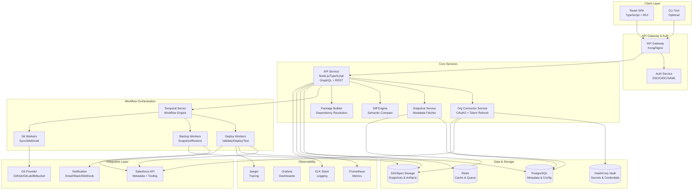

# SFOps - Salesforce Deployment SaaS Architecture

## System Overview

SFOps is a multi-tenant SaaS platform for Salesforce metadata deployment, comparison, backup, and CI/CD automation.

## Architecture Diagram

## Component Rationale

### 1. Frontend (React + TypeScript)
**Choice**: React SPA with TypeScript and Material-UI
**Rationale**:
- Rich ecosystem for enterprise UI components
- TypeScript for type safety and developer productivity
- Material-UI provides accessible, production-ready components
- Easy integration with GraphQL via Apollo Client

### 2. API Service (Node.js + TypeScript)
**Choice**: Node.js with Express/Fastify + GraphQL
**Rationale**:
- TypeScript enables shared types with frontend
- Excellent async/await support for I/O-heavy operations
- Rich ecosystem for Salesforce SDK and Git integrations
- GraphQL enables flexible querying for complex UI needs
- REST endpoints for webhooks and integrations

### 3. Workflow Orchestration (Temporal)
**Choice**: Temporal for durable workflow execution
**Rationale**:
- Built-in retry, timeout, and compensation logic
- Durable execution survives service restarts
- Visual workflow tracking and debugging
- Handles long-running deployments (hours)
- Built-in versioning for workflow updates
- Alternative: AWS Step Functions (vendor lock-in concern)

### 4. Database (PostgreSQL)
**Choice**: PostgreSQL with multi-tenant schema design
**Rationale**:
- ACID guarantees for audit logs and deployment state
- JSONB for flexible metadata storage
- Row-level security for tenant isolation
- Strong consistency for critical operations
- Proven scalability to millions of records

### 5. Caching & Queues (Redis)
**Choice**: Redis for caching and job queues
**Rationale**:
- Sub-millisecond response times for metadata cache
- Pub/sub for real-time deployment status updates
- Rate limiting for API protection
- Session storage for OAuth flows

### 6. Object Storage (S3-compatible)
**Choice**: S3 or compatible (MinIO, Google Cloud Storage)
**Rationale**:
- Cost-effective storage for large metadata snapshots
- Built-in versioning and lifecycle policies
- Deduplication via content-addressable storage
- Multi-region replication for DR

### 7. Secrets Management (HashiCorp Vault)
**Choice**: HashiCorp Vault with KMS integration
**Rationale**:
- Dynamic secrets with automatic rotation
- Encryption as a service for org credentials
- Audit logging for all secret access
- Per-tenant encryption keys via transit engine
- Integration with Kubernetes service accounts

### 8. Infrastructure (Kubernetes)
**Choice**: Kubernetes on EKS/GKE/AKS with Terraform
**Rationale**:
- Horizontal scaling for worker pools
- Rolling updates with zero downtime
- Resource limits and quotas per tenant
- Multi-AZ deployment for HA
- Terraform for reproducible infrastructure

### 9. Observability Stack
**Choice**: Prometheus + Grafana + OpenTelemetry + ELK
**Rationale**:
- Prometheus for metrics and alerting
- Grafana for unified dashboards
- OpenTelemetry for distributed tracing
- ELK for centralized log aggregation and search
- Standard, vendor-neutral observability

## Data Flow

### Deployment Flow
1. User selects changes in UI → API creates deployment job
2. API enqueues workflow in Temporal
3. DeployWorker starts workflow:
   - Create pre-deployment snapshot
   - Validate metadata against target org
   - Run Apex tests (if configured)
   - Deploy metadata to Salesforce
   - Poll deployment status
   - Record results in audit log
4. Real-time status updates via WebSocket/GraphQL subscription
5. On failure: automatic rollback option

### Comparison Flow
1. User requests compare between orgs
2. Snapshot service fetches metadata from both orgs (parallel)
3. Metadata cached in S3 and indexed in PostgreSQL
4. Diff engine computes semantic diff with dependencies
5. Results cached in Redis, returned to UI
6. User selects components → Package builder validates dependencies

### Git-Triggered Pipeline Flow
1. Git webhook received by API
2. Pipeline engine resolves target org and configuration
3. Temporal workflow started with Git context
4. Worker checks out commit, extracts metadata changes
5. Auto-select affected components
6. Run validation → tests → deploy based on pipeline config
7. Update commit status in Git provider
8. Send notifications on success/failure

## Security Architecture

### Multi-Tenant Isolation
- Database: Row-level security with tenant_id in all tables
- Application: Tenant context in JWT, enforced in middleware
- Object Storage: Tenant-prefixed buckets/paths
- Encryption: Per-tenant encryption keys via Vault transit engine

### Credential Management
1. Salesforce OAuth tokens encrypted in Vault
2. API services access Vault via Kubernetes service accounts
3. Token refresh automated by connector service
4. Tokens rotated every 7 days, expiry alerts at 3 days
5. All credential access logged to audit trail

### Network Security
- TLS 1.3 for all connections
- API Gateway rate limiting and DDoS protection
- WAF rules for injection attacks
- Private subnets for databases and workers
- VPC peering for multi-region setup

## Scalability Considerations

### Horizontal Scaling
- API: Stateless, scale to 100+ pods
- Workers: Auto-scale based on queue depth (10-1000 workers)
- Temporal: Clustered with matching service for large deployments
- PostgreSQL: Read replicas for reporting queries

### Performance Targets
- API response time: p95 < 200ms
- Snapshot fetch: < 30s for typical org (10k components)
- Diff computation: < 5s for 1k changed components
- Deployment: Dependent on Salesforce API (typically 5-30 min)
- Concurrent deployments: 500+ per cluster

### Data Retention
- Audit logs: 7 years (compliance requirement)
- Snapshots: Configurable per tenant (default 90 days)
- Deployment artifacts: 30 days
- Metrics: 13 months (Prometheus retention)

## High Availability

- Multi-AZ Kubernetes cluster (3 zones minimum)
- PostgreSQL with synchronous replication
- Redis Sentinel for automatic failover
- S3 cross-region replication for DR
- RTO: 15 minutes, RPO: 5 minutes

## Disaster Recovery

- Daily automated backups to separate region
- Weekly DR drills with restore validation
- Runbooks for data center failure scenarios
- Chaos engineering tests monthly

## Technology Stack Summary

| Layer | Technology | Version | Purpose |
|-------|-----------|---------|---------|
| Frontend | React | 18.x | UI Framework |
| Frontend | TypeScript | 5.x | Type Safety |
| Frontend | Material-UI | 5.x | Component Library |
| Frontend | Apollo Client | 3.x | GraphQL Client |
| API | Node.js | 20.x LTS | Runtime |
| API | TypeScript | 5.x | Language |
| API | Express | 4.x | HTTP Framework |
| API | GraphQL | 16.x | API Query Language |
| Orchestration | Temporal | 1.22.x | Workflow Engine |
| Database | PostgreSQL | 15.x | Primary Database |
| Cache | Redis | 7.x | Cache & Queue |
| Storage | S3 | - | Object Storage |
| Secrets | Vault | 1.15.x | Secret Management |
| Container | Docker | 24.x | Containerization |
| Orchestration | Kubernetes | 1.28.x | Container Orchestration |
| IaC | Terraform | 1.6.x | Infrastructure |
| Monitoring | Prometheus | 2.x | Metrics |
| Monitoring | Grafana | 10.x | Dashboards |
| Tracing | Jaeger | 1.x | Distributed Tracing |
| Logging | ELK Stack | 8.x | Log Aggregation |

## Deployment Model

### Environments
- **Development**: Local (Docker Compose + Kind)
- **Staging**: Single-region Kubernetes cluster
- **Production**: Multi-region Kubernetes with DR

### CI/CD Pipeline
1. Code push → GitHub Actions triggered
2. Run linting, unit tests, integration tests
3. Build Docker images, scan for vulnerabilities
4. Push to container registry
5. Update Helm charts with new image tags
6. GitOps: ArgoCD syncs to staging
7. Automated E2E tests in staging
8. Manual approval gate for production
9. Blue-green deployment to production
10. Smoke tests, then traffic switch

## API Design Principles

- RESTful for simple CRUD and webhooks
- GraphQL for complex queries and real-time subscriptions
- Versioned endpoints (/api/v1/...)
- Pagination, filtering, sorting on all list endpoints
- Rate limiting per tenant and endpoint
- OpenAPI spec for all REST endpoints
- GraphQL schema introspection for development

## Next Steps

Proceed to:
1. OpenAPI specification (API-SPEC.yaml)
2. Database schema (DATABASE.md)
3. Implementation of Phase 0 (project setup)
